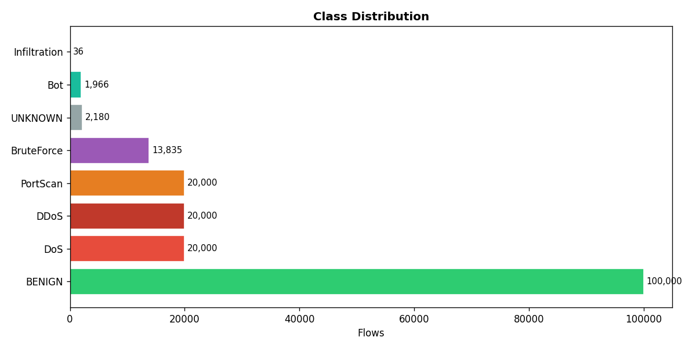
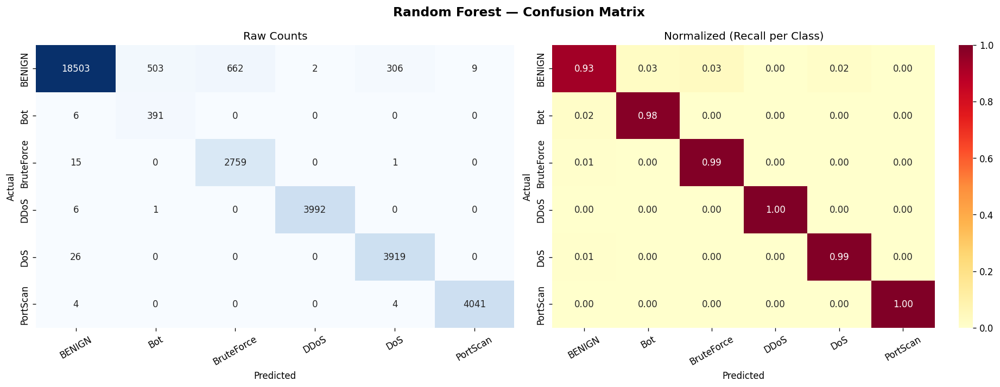
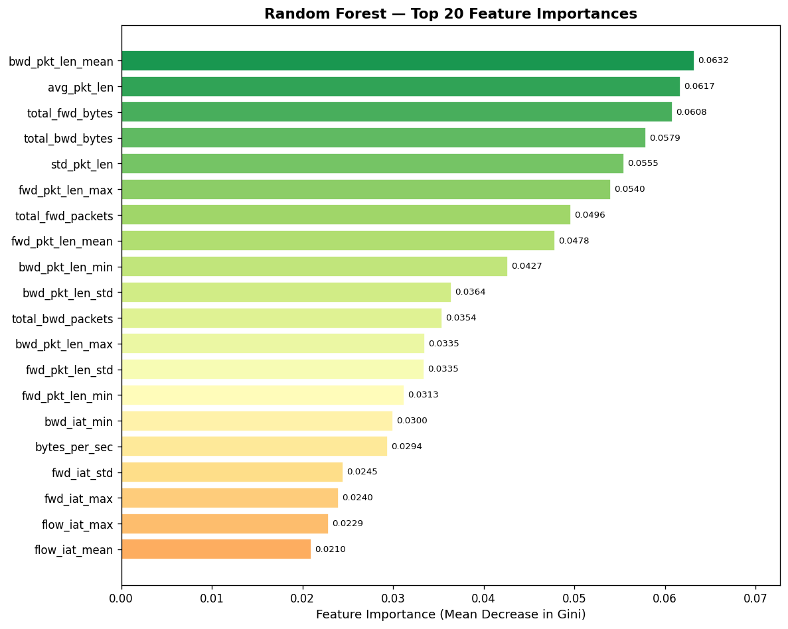
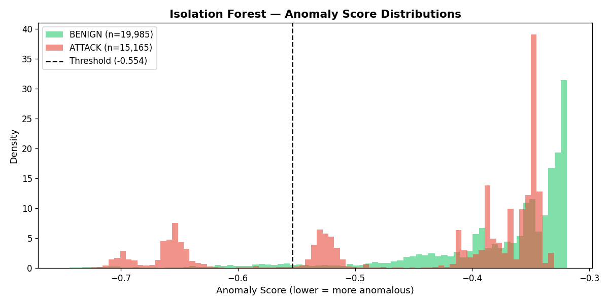

# 🛡️ NIDS — Network Intrusion Detection System

A real-time Network Intrusion Detection System built with **Python**, **Scapy**, and **scikit-learn**.  
Captures live network packets, extracts flow-level statistical features, and uses machine learning to detect and classify network attacks.

> **Cybersecurity portfolio project — B.Tech Cyber Security & Digital Forensics, VIT Bhopal**

---

## 📊 Model Performance

Trained on the **CICIDS-2017** benchmark dataset (Canadian Institute for Cybersecurity).  
175,000 labeled network flows across 6 traffic classes.

### Random Forest Classifier (Supervised)

| Metric | Score |
|--------|-------|
| Accuracy | **95.60%** |
| F1 (macro) | **0.9019** |
| F1 (weighted) | **0.9592** |

| Class | Precision | Recall | F1 |
|-------|-----------|--------|----|
| BENIGN | 1.00 | 0.93 | 0.96 |
| DoS | 0.93 | 0.99 | 0.96 |
| DDoS | 1.00 | 1.00 | **1.00** |
| PortScan | 1.00 | 1.00 | **1.00** |
| BruteForce | 0.81 | 0.99 | 0.89 |
| Bot | 0.44 | 0.98 | 0.61 |

> Bot traffic intentionally mimics normal behavior — low precision is expected and consistent with literature.

### Isolation Forest (Unsupervised Anomaly Detection)

Trained **only on BENIGN traffic** — detects anomalies without ever seeing labeled attacks.

| Metric | Value |
|--------|-------|
| Detection Rate (Recall) | 34.9% |
| False Alarm Rate | 14.9% |
| Precision | 64.0% |

> Unsupervised detection is inherently harder — the model has no knowledge of what attacks look like.  
> Used as a **second layer** to catch zero-day attacks the RF has never seen.

---

## 🗺️ Architecture

<pre>
Live Traffic
│
▼
┌─────────────┐
│   Scapy     │  ← Raw packet capture (Layer 2/3/4)
│  Sniffer    │
└──────┬──────┘
│ per-packet features
▼
┌─────────────┐
│    Flow     │  ← Groups packets into 5-tuple conversations
│   Tracker   │     (src_ip, src_port, dst_ip, dst_port, proto)
└──────┬──────┘
│ 36 statistical features per flow
▼
┌──────────────────────────────────┐
│         Feature Extractor        │
│  volume · timing · IAT · flags   │
│  byte ratios · port categories   │
└──────┬───────────────────┬───────┘
│                   │
▼                   ▼
┌─────────────┐    ┌──────────────────┐
│   Random    │    │    Isolation     │
│   Forest    │    │     Forest       │
│  (labeled)  │    │  (anomaly score) │
└──────┬──────┘    └────────┬─────────┘
│                    │
▼                    ▼
Attack Type          NORMAL / ANOMALY

Confidence         + Anomaly Score
</pre>

---

## 📈 Visualizations

### Class Distribution (CICIDS-2017 Training Data)


### Confusion Matrix


### Top 20 Feature Importances


### Isolation Forest — Anomaly Score Distributions


---

## 🏗️ Project Phases

| Phase | Description | Status |
|-------|-------------|--------|
| 1 | Foundation — Scapy sniffer, logger, project structure | ✅ Complete |
| 2 | Feature Engineering — flow tracking, 36 statistical features | ✅ Complete |
| 3 | Dataset & Preprocessing — CICIDS-2017, EDA, scaling | ✅ Complete |
| 4 | ML Training — Random Forest + Isolation Forest | ✅ Complete |
| 5 | Real-Time Detection — live model inference on captured flows | 🔜 Upcoming |
| 6 | Dashboard — Flask web UI with live alerts | 🔜 Upcoming |
| 7 | Polish — packaging, demo, final docs | 🔜 Upcoming |

---

## ⚙️ Setup

### Prerequisites
- Ubuntu Linux
- Python 3.10+
- Root/sudo access (for raw packet capture)

### Installation

```bash
git clone https://github.com/CRAzyAbd/nids-ml.git
cd nids-ml

python3 -m venv venv
source venv/bin/activate
pip install -r requirements.txt
```

### Configuration

Edit `config/settings.py` and set `INTERFACE` to your network interface:

```bash
ip link show   # find your interface name
nano config/settings.py   # set INTERFACE = "your_interface"
```

---

## 🚀 Usage

```bash
# Live packet capture (requires sudo)
sudo venv/bin/python3 main.py --mode capture

# Capture on specific interface, filter to TCP only
sudo venv/bin/python3 main.py --mode capture --interface wlan0 --filter "tcp"

# Preprocess CICIDS-2017 dataset (place CSVs in data/raw/MachineLearningCVE/)
python3 main.py --mode preprocess

# Exploratory data analysis
python3 main.py --mode eda

# Train ML models
python3 main.py --mode train
```

---

## 📁 Project Structure

<pre>
nids-project/
├── config/
│   └── settings.py              # All configuration constants
├── src/
│   ├── sniffer/
│   │   └── packet_capture.py    # Live Scapy packet sniffer
│   ├── features/
│   │   ├── flow.py              # Flow object (5-tuple conversation)
│   │   ├── flow_tracker.py      # Routes packets to flows, handles expiry
│   │   └── feature_extractor.py # Computes 36 statistical features
│   ├── data/
│   │   ├── dataset_loader.py    # CICIDS-2017 chunked loader
│   │   ├── preprocessor.py      # Cleaning, scaling, train/test split
│   │   └── feature_alignment.py # CICIDS ↔ live feature bridge
│   └── models/
│       ├── random_forest.py     # Supervised multiclass classifier
│       ├── isolation_forest.py  # Unsupervised anomaly detector
│       └── evaluator.py         # Metrics, charts, reports
├── scripts/
│   ├── train.py                 # Training pipeline
│   ├── eda.py                   # Exploratory data analysis
│   └── preprocess_data.py       # Preprocessing runner
├── data/
│   ├── raw/                     # CICIDS-2017 CSVs (not tracked by git)
│   ├── processed/               # Scaled train/test sets (not tracked)
│   └── reports/                 # EDA + training charts
├── models/                      # Saved .joblib model files (not tracked)
├── docs/images/                 # Charts embedded in this README
└── main.py                      # Entry point
</pre>

---

## 🧰 Tech Stack

| Tool | Purpose |
|------|---------|
| **Scapy** | Raw packet capture and protocol parsing |
| **scikit-learn** | Random Forest, Isolation Forest, StandardScaler |
| **pandas / numpy** | Data manipulation and feature computation |
| **matplotlib / seaborn** | EDA and evaluation visualizations |
| **joblib** | Model persistence |


