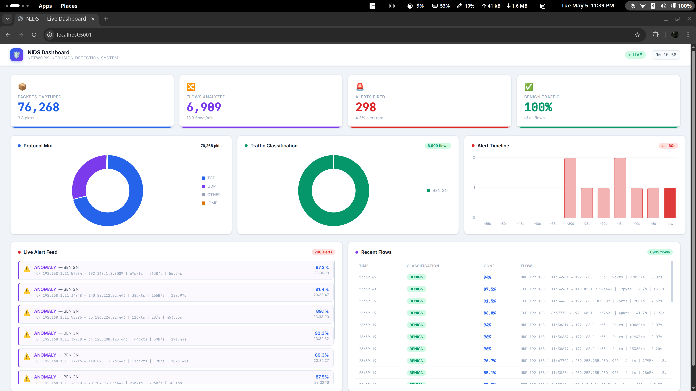
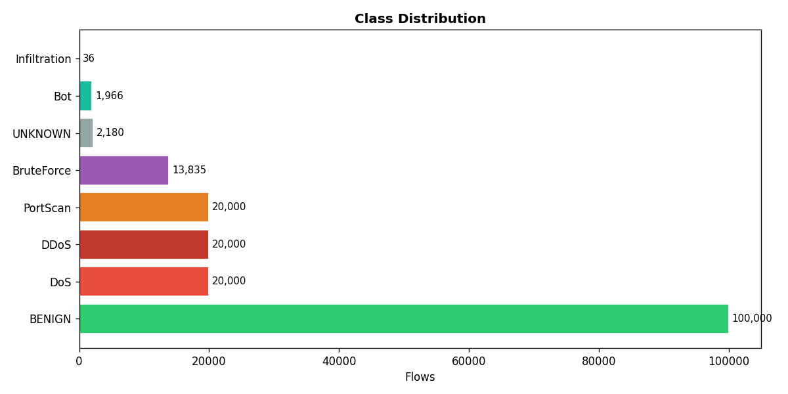
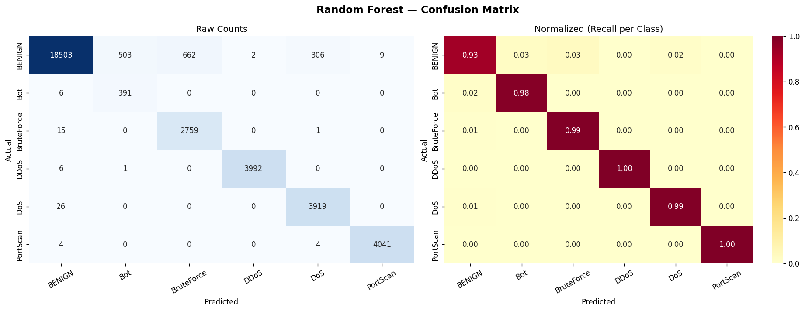
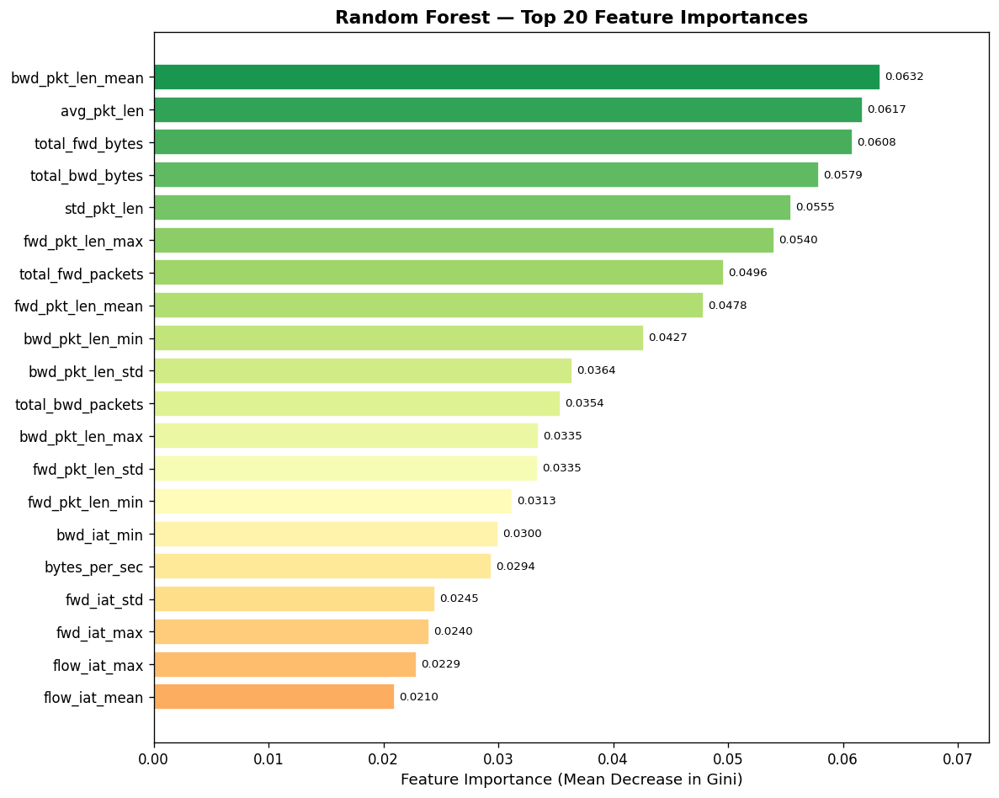
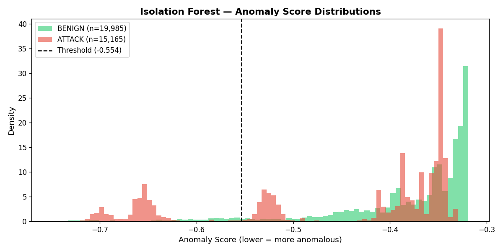

# 🛡️ NIDS — Network Intrusion Detection System

A real-time Network Intrusion Detection System built with **Python**, **Scapy**, and **scikit-learn**. Captures live network packets, extracts flow-level statistical features, and uses machine learning to detect and classify network attacks — all visualized in a live web dashboard.

> **B.Tech Cyber Security & Digital Forensics — VIT Bhopal**  
> Built as a full-stack cybersecurity portfolio project across 7 phases.

---

## 🖥️ Live Dashboard



---

## 📊 Model Performance

Trained on **CICIDS-2017** — the benchmark intrusion detection dataset by the Canadian Institute for Cybersecurity. 175,000 labeled network flows across 6 traffic classes.

### Random Forest Classifier (Supervised)

| Metric | Score |
|--------|-------|
| **Accuracy** | **95.60%** |
| **F1 (macro)** | **0.9019** |
| **F1 (weighted)** | **0.9592** |

| Class | Precision | Recall | F1 |
|-------|-----------|--------|----|
| BENIGN | 1.00 | 0.93 | 0.96 |
| DoS | 0.93 | 0.99 | 0.96 |
| **DDoS** | **1.00** | **1.00** | **1.00** |
| **PortScan** | **1.00** | **1.00** | **1.00** |
| BruteForce | 0.81 | 0.99 | 0.89 |
| Bot | 0.44 | 0.98 | 0.61 |

> Bot traffic is designed to mimic normal behavior — low precision is consistent with academic literature.

### Isolation Forest (Unsupervised Anomaly Detection)

Trained **only on BENIGN traffic** — detects zero-day attacks it has never seen labeled examples of.

| Metric | Value |
|--------|-------|
| Detection Rate | 20.0% |
| False Alarm Rate | **5.0%** |
| Precision | 75.4% |

> Used as a second defense layer — catches anomalous traffic the RF hasn't been trained to recognize.

---

## 🏗️ Architecture

<pre>
Live Traffic (wlo1 / eth0)
│
▼
┌─────────────────┐
│  Scapy Sniffer  │  Raw packet capture at Layer 2
└────────┬────────┘
│ per-packet features
▼
┌─────────────────┐
│  Flow Tracker   │  Groups packets into 5-tuple flows
│  (5-tuple)      │  (src_ip, src_port, dst_ip, dst_port, proto)
└────────┬────────┘
│ completed flow
▼
┌─────────────────────────────────┐
│       Feature Extractor         │
│  36 statistical features:       │
│  volume · timing · IAT · flags  │
│  byte ratios · packet lengths   │
└──────────┬──────────────────────┘
│
┌──────┴──────┐
▼             ▼
┌────────┐  ┌──────────────┐
│  RF    │  │  Isolation   │
│ (96%)  │  │   Forest     │
└───┬────┘  └──────┬───────┘
│              │
▼              ▼
Attack Type   ANOMALY / NORMAL

Confidence  + Anomaly Score
│              │
└──────┬───────┘
▼
┌─────────────┐
│   Dashboard │  http://localhost:5001
│  Flask+WS   │  Live charts + alert feed
└─────────────┘
</pre>

---

## 🗺️ Project Phases

| Phase | Description | Status |
|-------|-------------|--------|
| 1 | Foundation — Scapy sniffer, logger, project structure | ✅ |
| 2 | Feature Engineering — flow tracking, 36 statistical features | ✅ |
| 3 | Dataset & Preprocessing — CICIDS-2017, EDA, StandardScaler | ✅ |
| 4 | ML Training — Random Forest + Isolation Forest | ✅ |
| 5 | Real-Time Detection — live model inference, alert engine | ✅ |
| 6 | Web Dashboard — Flask + SocketIO, live charts | ✅ |
| 7 | Polish — demo script, setup automation, documentation | ✅ |

---

## ⚙️ Setup

### Requirements
- Ubuntu Linux (20.04+)
- Python 3.10+
- Root/sudo access (for raw packet capture)

### Quick Setup

```bash
git clone https://github.com/CRAzyAbd/nids-ml.git
cd nids-ml
bash setup.sh
```

### Manual Setup

```bash
# Create and activate virtual environment
python3 -m venv venv
source venv/bin/activate

# Install dependencies
pip install -r requirements.txt

# Find your network interface
ip link show
# Edit config/settings.py and set INTERFACE = "your_interface"
```

### Dataset

Download **CICIDS-2017** from the University of New Brunswick:
> https://www.unb.ca/cic/datasets/ids-2017.html

Place the CSV files in `data/raw/MachineLearningCVE/`

---

## 🚀 Usage

```bash
# Launch live dashboard (recommended)
sudo venv/bin/python3 main.py --mode dashboard
# Open http://localhost:5001

# Terminal-only detection with colored alerts
sudo venv/bin/python3 main.py --mode detect

# Preprocess the CICIDS-2017 dataset
python3 main.py --mode preprocess

# Exploratory data analysis
python3 main.py --mode eda

# Train models
python3 main.py --mode train

# Run attack demo (while dashboard is running)
python3 scripts/demo_attack.py
```

---

## 📁 Project Structure

nids-project/
├── config/
│   └── settings.py              # All configuration constants
├── src/
│   ├── sniffer/
│   │   └── packet_capture.py    # Live Scapy packet sniffer
│   ├── features/
│   │   ├── flow.py              # Flow object (5-tuple conversation)
│   │   ├── flow_tracker.py      # Routes packets to flows
│   │   └── feature_extractor.py # Computes 36 statistical features
│   ├── data/
│   │   ├── dataset_loader.py    # CICIDS-2017 chunked loader
│   │   ├── preprocessor.py      # Cleaning, scaling, splitting
│   │   └── feature_alignment.py # CICIDS ↔ live feature bridge
│   ├── models/
│   │   ├── random_forest.py     # Supervised multiclass classifier
│   │   ├── isolation_forest.py  # Unsupervised anomaly detector
│   │   └── evaluator.py         # Metrics, charts, reports
│   ├── detection/
│   │   ├── detector.py          # Real-time inference engine
│   │   └── alert_engine.py      # Terminal alert formatter
│   └── dashboard/
│       ├── app.py               # Flask + SocketIO server
│       └── templates/index.html # Live dashboard UI
├── scripts/
│   ├── train.py                 # Full training pipeline
│   ├── eda.py                   # Exploratory data analysis
│   ├── preprocess_data.py       # Preprocessing runner
│   └── demo_attack.py           # Attack simulation demo
├── docs/images/                 # README charts and screenshots
├── data/reports/                # EDA + training charts
├── setup.sh                     # One-command setup
├── main.py                      # Entry point
└── requirements.txt

---

## 📈 EDA Visualizations

### Class Distribution


### Confusion Matrix


### Feature Importances


### Anomaly Score Distribution


---

## 🧰 Tech Stack

| Tool | Purpose |
|------|---------|
| **Scapy** | Raw packet capture and protocol parsing |
| **scikit-learn** | Random Forest, Isolation Forest, StandardScaler |
| **pandas / numpy** | Data manipulation and feature computation |
| **Flask + SocketIO** | Real-time web dashboard |
| **Chart.js** | Live browser charts |
| **matplotlib / seaborn** | EDA and evaluation visualizations |
| **joblib** | Model persistence |

---

## 📄 License

MIT License — see [LICENSE](LICENSE) for details.
